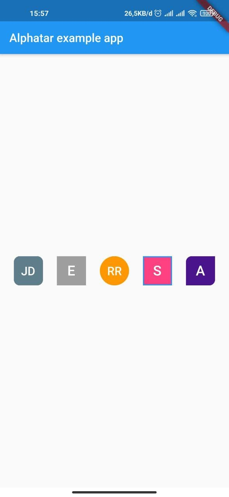

# Alphatar


Create an avatar with the initials of your text.

## Screenshot

<p align="center">
    
</p>


## Installation

In the `dependencies:` section of your `pubspec.yaml`, add the following line:

```yaml
alphatar: <latest_version>
```

## Usage

You can use it very easily. For example:

```dart
class Example extends StatelessWidget {
  const Example({Key key}) : super(key: key);

  @override
  Widget build(BuildContext context) {
    return Container(
      alignment: Alignment.center,
      child: Alphatar(
        initials: "Alice",
        backgroundColor: Colors.purple[900],
        onTap: () => print("Awesome!"),
      ),
    );
  }
}
```

## License

MIT